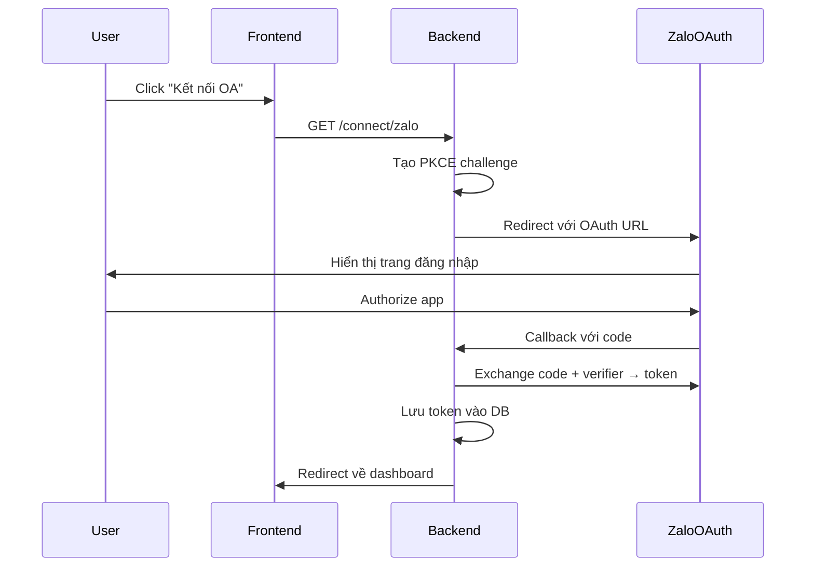

# 📚 Tài Liệu Hướng Dẫn Chi Tiết - Zalo Chat System

## 🎯 Tổng Quan

Hệ thống **Zalo Chat System** được phát triển bởi AI Pencil cho phép kết nối và quản lý cả **Zalo Official Account (OA)** và **tài khoản Zalo cá nhân**, hỗ trợ nhận/gửi tin nhắn realtime với giao diện chat trực quan.

### ✨ Tính Năng Chính

1. **Kết nối đa tài khoản**: Hỗ trợ kết nối nhiều Zalo OA và tài khoản cá nhân
2. **Chat realtime**: Gửi/nhận tin nhắn ngay lập tức qua WebSocket
3. **Xác thực QR Code**: Kết nối tài khoản cá nhân bằng QR Code 
4. **Dashboard tổng hợp**: Quản lý tất cả tài khoản từ một giao diện
5. **Auto-reply**: Chatbot tự động phản hồi tin nhắn
6. **Lưu trữ lịch sử**: Tất cả tin nhắn được lưu trong PostgreSQL

---

## 🏗️ Kiến Trúc Hệ Thống

```
┌─────────────────┐    ┌─────────────────┐    ┌─────────────────┐
│   Frontend      │    │   Backend       │    │   Database      │
│   (HTML/JS)     │◄──►│   (Node.js)     │◄──►│  (PostgreSQL)   │
└─────────────────┘    └─────────────────┘    └─────────────────┘
                              │
                              ▼
                    ┌─────────────────┐
                    │   Zalo APIs     │
                    │  (OA + Personal) │
                    └─────────────────┘
```

### 🔧 Tech Stack

- **Backend**: Node.js, Express.js, Socket.IO
- **Frontend**: Vanilla HTML/CSS/JavaScript
- **Database**: PostgreSQL
- **Authentication**: OAuth 2.0 + PKCE
- **Realtime**: WebSocket (Socket.IO)

---

## 📋 Cài Đặt & Cấu Hình

### 1. Yêu Cầu Hệ Thống

```
- Node.js >= 16.0.0
- PostgreSQL >= 12.0
- Zalo Developer Account
```

### 2. Cài Đặt Dependencies

```bash
# Clone repository
git clone <repo-url>
cd Zalo_Chat

# Cài đặt packages
npm install
```

### 3. Thiết Lập Database

```sql
-- Tạo database
CREATE DATABASE zalo_chat;

-- Bảng lưu thông tin OA
CREATE TABLE zalo_oas (
    oa_id VARCHAR(255) PRIMARY KEY,
    status VARCHAR(50) DEFAULT 'verified',
    name VARCHAR(255),
    avatar TEXT,
    created_at TIMESTAMP DEFAULT CURRENT_TIMESTAMP,
    updated_at TIMESTAMP DEFAULT CURRENT_TIMESTAMP
);

-- Bảng lưu token OA
CREATE TABLE zalo_tokens (
    oa_id VARCHAR(255) PRIMARY KEY,
    access_token TEXT NOT NULL,
    refresh_token TEXT,
    expires_at TIMESTAMP NOT NULL,
    created_at TIMESTAMP DEFAULT CURRENT_TIMESTAMP,
    updated_at TIMESTAMP DEFAULT CURRENT_TIMESTAMP,
    FOREIGN KEY (oa_id) REFERENCES zalo_oas(oa_id)
);

-- Bảng lưu thông tin user cá nhân
CREATE TABLE zalo_personal_users (
    zalo_user_id VARCHAR(255) PRIMARY KEY,
    display_name VARCHAR(255) NOT NULL,
    avatar TEXT,
    created_at TIMESTAMP DEFAULT CURRENT_TIMESTAMP,
    updated_at TIMESTAMP DEFAULT CURRENT_TIMESTAMP
);

-- Bảng lưu token user cá nhân
CREATE TABLE zalo_personal_tokens (
    zalo_user_id VARCHAR(255) PRIMARY KEY,
    access_token TEXT NOT NULL,
    refresh_token TEXT,
    expires_at TIMESTAMP NOT NULL,
    scopes TEXT[] DEFAULT ARRAY['profile'],
    created_at TIMESTAMP DEFAULT CURRENT_TIMESTAMP,
    updated_at TIMESTAMP DEFAULT CURRENT_TIMESTAMP,
    FOREIGN KEY (zalo_user_id) REFERENCES zalo_personal_users(zalo_user_id)
);

-- Bảng lưu events webhook
CREATE TABLE webhook_events (
    id SERIAL PRIMARY KEY,
    oa_id VARCHAR(255),
    event_type VARCHAR(100) NOT NULL,
    payload JSONB NOT NULL,
    received_at TIMESTAMP DEFAULT CURRENT_TIMESTAMP,
    INDEX idx_oa_event (oa_id, event_type),
    INDEX idx_received_at (received_at)
);
```

### 4. Cấu Hình Môi Trường

Tạo file `.env`:

```env
# Zalo App Configuration
ZALO_APP_ID=your_zalo_app_id
ZALO_APP_SECRET=your_zalo_app_secret

# Redirect URIs (Development vs Production)
ZALO_REDIRECT_URI_DEV=http://localhost:3000/oauth/zalo/callback
ZALO_REDIRECT_URI_PROD=https://yourdomain.com/oauth/zalo/callback

# Database Configuration
DB_HOST=localhost
DB_PORT=5432
DB_USER=your_db_user
DB_PASSWORD=your_db_password
DB_DATABASE=zalo_chat

# Server Configuration
PORT=3000
NODE_ENV=development
SESSION_SECRET=your-secure-session-secret
```

---

## 🔐 Xác Thực & Kết Nối

### 1. Kết Nối Zalo Official Account (OA)

#### Workflow OAuth cho OA:



#### Code Implementation:

```javascript
// 1. Route khởi tạo OAuth
app.get("/connect/zalo", (req, res) => {
  const state = crypto.randomBytes(16).toString("hex");
  
  // Tạo PKCE parameters
  const codeVerifier = crypto.randomBytes(32).toString("hex");
  const codeChallenge = crypto
    .createHash("sha256")
    .update(codeVerifier)
    .digest("base64")
    .replace(/\+/g, "-")
    .replace(/\//g, "_")
    .replace(/=/g, "");

  // Lưu verifier để dùng ở callback
  pkceStore.set(state, codeVerifier);

  const authUrl = new URL("https://oauth.zaloapp.com/v4/oa/permission");
  authUrl.searchParams.set("app_id", ZALO_APP_ID);
  authUrl.searchParams.set("redirect_uri", ZALO_REDIRECT_URI);
  authUrl.searchParams.set("state", state);
  authUrl.searchParams.set("code_challenge", codeChallenge);
  authUrl.searchParams.set("code_challenge_method", "S256");

  res.redirect(authUrl.toString());
});

// 2. Route xử lý callback
app.get("/oauth/zalo/callback", async (req, res) => {
  const { code, state, oa_id } = req.query;
  
  const codeVerifier = pkceStore.get(state);
  if (!codeVerifier) {
    return res.status(400).send("State không hợp lệ");
  }
  pkceStore.delete(state);

  try {
    // Exchange code với token
    const tokenResponse = await axios.post(
      "https://oauth.zaloapp.com/v4/oa/access_token",
      new URLSearchParams({
        grant_type: "authorization_code",
        app_id: ZALO_APP_ID,
        code: code,
        code_verifier: codeVerifier,
      }),
      { headers: { "secret_key": ZALO_APP_SECRET } }
    );

    const { access_token, refresh_token, expires_in } = tokenResponse.data;
    
    // Lưu vào database
    const expiresAt = new Date(Date.now() + (expires_in - 300) * 1000);
    await db.query(
      `INSERT INTO zalo_oas (oa_id, status) VALUES ($1, 'verified') 
       ON CONFLICT (oa_id) DO NOTHING`,
      [oa_id]
    );
    await db.query(
      `INSERT INTO zalo_tokens (oa_id, access_token, refresh_token, expires_at) 
       VALUES ($1, $2, $3, $4) 
       ON CONFLICT (oa_id) DO UPDATE SET 
       access_token = EXCLUDED.access_token, 
       refresh_token = EXCLUDED.refresh_token, 
       expires_at = EXCLUDED.expires_at`,
      [oa_id, access_token, refresh_token, expiresAt]
    );

    // Lưu vào session
    req.session.connectedAccounts = req.session.connectedAccounts || { oas: {}, personal: {} };
    req.session.connectedAccounts.oas[oa_id] = {
      name: `Official Account ${oa_id}`,
      avatar: 'https://developers.zalo.me/web/static/prod/images/zalo-logo.svg',
      type: 'oa'
    };

    res.redirect('/dashboard');
  } catch (error) {
    console.error("Lỗi OAuth:", error);
    res.status(500).send("Lỗi khi xử lý token");
  }
});
```

### 2. Kết Nối Tài Khoản Zalo Cá Nhân

#### A. Kết nối bằng Browser (Direct OAuth):

```javascript
app.get("/connect/zalo-user", (req, res) => {
  const state = crypto.randomBytes(16).toString("hex");
  
  const personalRedirectUri = NODE_ENV === 'production' 
    ? 'https://yourdomain.com/oauth/zalo/user/callback'
    : 'http://localhost:3000/oauth/zalo/user/callback';

  const authUrl = new URL("https://oauth.zaloapp.com/v4/permission");
  authUrl.searchParams.set("app_id", ZALO_APP_ID);
  authUrl.searchParams.set("redirect_uri", personalRedirectUri);
  authUrl.searchParams.set("state", state);
  authUrl.searchParams.set("scope", "profile");

  res.redirect(authUrl.toString());
});

app.get("/oauth/zalo/user/callback", async (req, res) => {
  const { code } = req.query;
  
  try {
    // Lấy access token
    const tokenResponse = await axios.post(
      'https://oauth.zaloapp.com/v4/access_token',
      new URLSearchParams({
        code,
        app_id: ZALO_APP_ID,
        grant_type: 'authorization_code',
        redirect_uri: personalRedirectUri
      }),
      { headers: { 'secret_key': ZALO_APP_SECRET } }
    );

    const { access_token, refresh_token, expires_in } = tokenResponse.data;

    // Lấy thông tin profile
    const profileResponse = await axios.get(
      'https://graph.zalo.me/v2.0/me',
      {
        params: { fields: 'id,name,picture' },
        headers: { 'access_token': access_token }
      }
    );

    const { id: zalo_user_id, name: display_name, picture } = profileResponse.data;
    const avatar = picture.data.url;

    // Lưu vào database
    const expiresAt = new Date(Date.now() + (expires_in - 300) * 1000);
    await db.query(`
      INSERT INTO zalo_personal_users (zalo_user_id, display_name, avatar) 
      VALUES ($1, $2, $3)
      ON CONFLICT (zalo_user_id) DO UPDATE SET 
      display_name = EXCLUDED.display_name, 
      avatar = EXCLUDED.avatar
    `, [zalo_user_id, display_name, avatar]);

    await db.query(`
      INSERT INTO zalo_personal_tokens (zalo_user_id, access_token, refresh_token, expires_at, scopes) 
      VALUES ($1, $2, $3, $4, $5)
      ON CONFLICT (zalo_user_id) DO UPDATE SET 
      access_token = EXCLUDED.access_token, 
      refresh_token = EXCLUDED.refresh_token, 
      expires_at = EXCLUDED.expires_at, 
      scopes = EXCLUDED.scopes
    `, [zalo_user_id, access_token, refresh_token, expiresAt, ['profile']]);

    // Lưu vào session
    req.session.connectedAccounts = req.session.connectedAccounts || { oas: {}, personal: {} };
    req.session.connectedAccounts.personal[zalo_user_id] = {
      name: display_name,
      avatar: avatar,
      type: 'personal'
    };

    res.redirect('/dashboard');
  } catch (error) {
    console.error("Lỗi personal OAuth:", error);
    res.status(500).send("Lỗi khi xác thực tài khoản cá nhân");
  }
});
```

#### B. Kết nối bằng QR Code:

```javascript
// 1. API tạo QR Code
app.post('/api/generate-personal-qr', async (req, res) => {
  try {
    const { state } = req.body;
    
    const personalRedirectUri = NODE_ENV === 'production' 
      ? 'https://yourdomain.com/oauth/zalo/user/qr-callback'
      : 'http://localhost:3000/oauth/zalo/user/qr-callback';

    const authUrl = new URL("https://oauth.zaloapp.com/v4/permission");
    authUrl.searchParams.set("app_id", ZALO_APP_ID);
    authUrl.searchParams.set("redirect_uri", personalRedirectUri);
    authUrl.searchParams.set("state", state);
    authUrl.searchParams.set("scope", "profile");

    // Lưu trạng thái QR (expire sau 5 phút)
    qrAuthStore.set(state, {
      created: Date.now(),
      expires: Date.now() + (5 * 60 * 1000),
      authenticated: false,
      userInfo: null
    });

    res.json({
      success: true,
      qrData: authUrl.toString(),
      expires: Date.now() + (5 * 60 * 1000)
    });
  } catch (error) {
    res.status(500).json({ success: false, message: 'Server error' });
  }
});

// 2. API check trạng thái QR
app.get('/api/check-personal-auth-status', (req, res) => {
  const { state } = req.query;
  const authData = qrAuthStore.get(state);
  
  if (!authData || authData.expires < Date.now()) {
    qrAuthStore.delete(state);
    return res.json({ authenticated: false, expired: true });
  }

  res.json({
    authenticated: authData.authenticated,
    expired: false,
    userInfo: authData.userInfo
  });
});

// 3. Callback cho QR authentication
app.get("/oauth/zalo/user/qr-callback", async (req, res) => {
  const { code, state } = req.query;
  
  const authData = qrAuthStore.get(state);
  if (!authData || authData.expires < Date.now()) {
    return res.status(400).send("QR code đã hết hạn");
  }

  try {
    // Xử lý OAuth tương tự như trên...
    // Sau khi thành công:
    authData.authenticated = true;
    authData.userInfo = { zalo_user_id, display_name, avatar };

    res.send(`
      <!DOCTYPE html>
      <html>
      <head><title>Xác thực thành công</title></head>
      <body>
        <h2>✅ Xác thực thành công!</h2>
        <p>Bạn có thể đóng cửa sổ này.</p>
        <script>
          setTimeout(() => {
            if (window.opener) window.close();
            else window.location.href = '/qr-personal.html';
          }, 3000);
        </script>
      </body>
      </html>
    `);
  } catch (error) {
    console.error("QR callback error:", error);
    res.status(500).send("Lỗi xác thực");
  }
});
```

---

## 💬 Gửi & Nhận Tin Nhắn

### 1. Nhận Tin Nhắn (Webhook)

```javascript
app.post("/zalo/webhook", async (req, res) => {
  res.status(200).send("OK");
  
  try {
    const event = req.body;
    const { event_name, oa_id, sender, message } = event;
    
    // Lưu event vào database
    await db.query(
      `INSERT INTO webhook_events (oa_id, event_type, payload) VALUES ($1, $2, $3)`,
      [oa_id, event_name, event]
    );
    
    // Broadcast realtime tới clients
    io.to(`oa_${oa_id}`).emit('zalo_event', event);
    
    // Xử lý auto-reply
    if (event_name === 'user_send_text') {
      const receivedText = message?.text?.toLowerCase().trim();
      const userId = sender?.id;
      
      if (receivedText === "xin chào" || receivedText === "hello") {
        await sendTextMessage(oa_id, userId, "Xin chào! Tôi là chatbot của AI Pencil. Tôi có thể giúp gì cho bạn? 😊");
      } else if (receivedText === "help") {
        await sendTextMessage(oa_id, userId, "Các lệnh có sẵn:\n• 'xin chào' - Chào hỏi\n• 'help' - Trợ giúp\n• 'info' - Thông tin dịch vụ");
      } else if (receivedText === "info") {
        await sendTextMessage(oa_id, userId, "🚀 AI Pencil - Nền tảng tự động hóa Zalo OA\n📧 support@aipencil.com\n🌐 https://aipencil.name.vn");
      }
    } else if (event_name === 'follow') {
      await sendTextMessage(oa_id, sender?.id, "🎉 Chào mừng bạn đến với AI Pencil!\n\nGửi 'help' để xem hướng dẫn.");
    }
    
  } catch (error) {
    console.error("Webhook error:", error);
  }
});
```

### 2. Gửi Tin Nhắn

```javascript
// API gửi tin nhắn từ dashboard
app.post("/api/send-message", async (req, res) => {
  const { oa_id, user_id, text } = req.body;
  
  if (!oa_id || !user_id || !text) {
    return res.status(400).json({ success: false, message: "Thiếu thông tin" });
  }
  
  const success = await sendTextMessage(oa_id, user_id, text);
  
  if (success) {
    res.json({ success: true, message: "Gửi thành công" });
  } else {
    res.status(500).json({ success: false, message: "Gửi thất bại" });
  }
});

// Function gửi tin nhắn (trong zalo_api.js)
export async function sendTextMessage(oa_id, user_id, text) {
  try {
    const accessToken = await getValidAccessToken(oa_id);
    if (!accessToken) return false;

    const messageData = {
      recipient: { user_id: user_id },
      message: { text: text }
    };

    const response = await axios.post(
      'https://openapi.zalo.me/v3.0/oa/message/cs',
      messageData,
      {
        headers: {
          'Authorization': `Bearer ${accessToken}`,
          'Content-Type': 'application/json',
        },
      }
    );

    if (response.data.error === 0) {
      // Lưu event gửi tin nhắn
      const oaSendEvent = {
        event_name: 'oa_send_text',
        oa_id: oa_id,
        recipient: { id: user_id },
        message: { text: text, msg_id: `oa_msg_${Date.now()}_${user_id}` },
        timestamp: Date.now()
      };
      
      await db.query(
        `INSERT INTO webhook_events (oa_id, event_type, payload) VALUES ($1, $2, $3)`,
        [oa_id, 'oa_send_text', oaSendEvent]
      );
      
      return true;
    } else {
      console.error('Zalo API error:', response.data.message);
      return false;
    }
  } catch (error) {
    console.error('Send message error:', error);
    return false;
  }
}
```

## ⚡ WebSocket Realtime

### 1. Server-side Socket.IO

```javascript
// Socket.IO setup
io.on('connection', (socket) => {
  console.log('🟢 User connected');
  
  // Client join room cho OA cụ thể
  socket.on('join_oa_room', (oa_id) => {
    socket.join(`oa_${oa_id}`);
    console.log(`👤 Client joined room: oa_${oa_id}`);
  });
  
  // Client leave room
  socket.on('leave_oa_room', (oa_id) => {
    socket.leave(`oa_${oa_id}`);
    console.log(`👋 Client left room: oa_${oa_id}`);
  });
  
  socket.on('disconnect', () => {
    console.log('🔴 User disconnected');
  });
});

// Broadcast tin nhắn mới tới clients
// (trong webhook handler)
io.to(`oa_${oa_id}`).emit('zalo_event', event);
```

### 2. Client-side Socket Handling

```javascript
// Kết nối Socket.IO
const socket = io();

// Join room cho OA hiện tại
socket.emit('join_oa_room', currentOaId);

// Lắng nghe tin nhắn mới
socket.on('zalo_event', (event) => {
    console.log('New event:', event);
    
    if (event.event_name === 'user_send_text') {
        // Hiển thị tin nhắn mới từ user
        displayNewMessage(event);
        
        // Cập nhật conversation list
        updateConversationList(event);
        
        // Hiển thị notification
        showNotification(`Tin nhắn mới từ ${event.sender.displayName}`);
    } else if (event.event_name === 'oa_send_text') {
        // Hiển thị tin nhắn OA đã gửi
        displayNewMessage(event);
    }
});

function displayNewMessage(event) {
    const messageElement = createMessageElement(event);
    document.getElementById('messages-container').appendChild(messageElement);
    scrollToBottom();
}

function showNotification(message) {
    if (Notification.permission === 'granted') {
        new Notification('Zalo OA Chat', {
            body: message,
            icon: '/favicon.ico'
        });
    }
}
```

---

## 🚀 APIs Reference

### 1. Authentication APIs

| Endpoint | Method | Description |
|----------|--------|-------------|
| `/connect/zalo` | GET | Khởi tạo OAuth cho OA |
| `/oauth/zalo/callback` | GET | Callback OAuth OA |
| `/connect/zalo-user` | GET | Khởi tạo OAuth personal |
| `/oauth/zalo/user/callback` | GET | Callback OAuth personal |
| `/api/generate-personal-qr` | POST | Tạo QR code personal |
| `/api/check-personal-auth-status` | GET | Check trạng thái QR |
| `/oauth/zalo/user/qr-callback` | GET | Callback QR auth |
| `/api/complete-qr-login` | POST | Hoàn tất QR login |

### 2. Account Management APIs

| Endpoint | Method | Description |
|----------|--------|-------------|
| `/api/get-connected-accounts` | GET | Lấy tất cả tài khoản |
| `/api/get-connected-oas` | GET | Lấy danh sách OA (legacy) |
| `/api/personal-profile/:userId` | GET | Thông tin personal profile |

### 3. Messaging APIs

| Endpoint | Method | Description |
|----------|--------|-------------|
| `/zalo/webhook` | POST | Webhook nhận tin nhắn |
| `/api/send-message` | POST | Gửi tin nhắn |
| `/api/conversations/:oa_id` | GET | Danh sách hội thoại |
| `/api/messages/:oa_id/:user_id` | GET | Lịch sử tin nhắn |
| `/api/user-info/:oa_id/:user_id` | GET | Thông tin user |
| `/api/crawl-messages/:oa_id` | POST | Crawl tin nhắn cũ |

### 4. Pages

| Route | Description |
|-------|-------------|
| `/` | Landing page |
| `/dashboard` | Dashboard quản lý |
| `/chat/:oaId` | Chat OA |
| `/chat/personal/:userId` | Chat personal |
| `/profile/:userId` | Profile personal |
| `/qr-personal.html` | QR Code page |

---

## 🔧 Troubleshooting

### 1. Lỗi Thường Gặp

#### OAuth Error: "Invalid redirect URI"
```
Nguyên nhân: Redirect URI không khớp với cấu hình Zalo App
Giải pháp: 
- Kiểm tra ZALO_REDIRECT_URI trong .env
- Đảm bảo URL được đăng ký chính xác trong Zalo Developer
```

#### Database Connection Error
```
Nguyên nhân: PostgreSQL chưa được cấu hình đúng
Giải pháp:
- Kiểm tra DB credentials trong .env
- Đảm bảo PostgreSQL đang chạy
- Tạo database và tables cần thiết
```

#### Webhook Not Receiving Events
```
Nguyên nhân: 
- Webhook URL chưa được đăng ký
- Firewall chặn incoming requests
Giải pháp:
- Đăng ký webhook URL trong Zalo OA Settings
- Mở port và cấu hình reverse proxy
- Test với ngrok để development
```

#### QR Code Expired
```
Nguyên nhân: QR code có thời gian sống 5 phút
Giải pháp: Click "Thử lại" để tạo QR mới
```

### 2. Debug & Logging

```javascript
// Enable debug logs
console.log('🔍 Debug mode enabled');

// Database query logging
export default {
  query: (text, params) => {
    console.log('📊 SQL:', text, params);
    return pool.query(text, params);
  },
};

// API request logging
app.use((req, res, next) => {
  console.log(`${req.method} ${req.path}`, req.body);
  next();
});
```

### 3. Development với ngrok

```bash
# Cài đặt ngrok
npm install -g ngrok

# Expose local server
ngrok http 3000

# Update .env với ngrok URL
ZALO_REDIRECT_URI_DEV=https://abc123.ngrok.io/oauth/zalo/callback
```

---

## 🔐 Security Best Practices

### 1. Environment Variables
```env
# Production settings
NODE_ENV=production
SESSION_SECRET=super-secure-random-string-change-this
```

### 2. HTTPS & SSL
```javascript
// Production middleware
if (NODE_ENV === 'production') {
    app.set('trust proxy', 1);
    app.use((req, res, next) => {
        res.header('X-Content-Type-Options', 'nosniff');
        res.header('X-Frame-Options', 'DENY');
        res.header('X-XSS-Protection', '1; mode=block');
        next();
    });
}
```

### 3. Rate Limiting
```javascript
import rateLimit from 'express-rate-limit';

const limiter = rateLimit({
  windowMs: 15 * 60 * 1000, // 15 minutes
  max: 100 // limit each IP to 100 requests per windowMs
});

app.use('/api/', limiter);
```

### 4. Input Validation
```javascript
// Sanitize webhook input
app.post("/zalo/webhook", express.raw({ type: 'application/json' }), (req, res) => {
  // Verify webhook signature
  const signature = req.headers['x-zalo-signature'];
  if (!verifyWebhookSignature(req.body, signature)) {
    return res.status(401).send('Unauthorized');
  }
  // ... rest of handler
});
```

---

## 📈 Performance Optimization

### 1. Database Indexing
```sql
-- Optimize queries
CREATE INDEX idx_webhook_events_oa_event ON webhook_events(oa_id, event_type);
CREATE INDEX idx_webhook_events_received_at ON webhook_events(received_at);
CREATE INDEX idx_zalo_tokens_expires ON zalo_tokens(expires_at);
```

### 2. Connection Pooling
```javascript
// PostgreSQL pool configuration
const pool = new Pool({
  host: process.env.DB_HOST,
  port: process.env.DB_PORT,
  user: process.env.DB_USER,
  password: process.env.DB_PASSWORD,
  database: process.env.DB_DATABASE,
  max: 20, // Maximum pool size
  idleTimeoutMillis: 30000,
  connectionTimeoutMillis: 2000,
});
```

### 3. Caching
```javascript
// Simple in-memory cache for access tokens
const tokenCache = new Map();

export async function getValidAccessToken(oa_id) {
  // Check cache first
  const cached = tokenCache.get(oa_id);
  if (cached && cached.expires > Date.now()) {
    return cached.token;
  }
  
  // Query database
  const result = await db.query(
    'SELECT access_token, expires_at FROM zalo_tokens WHERE oa_id = $1 AND expires_at > NOW()',
    [oa_id]
  );
  
  if (result.rows.length > 0) {
    const token = result.rows[0].access_token;
    const expires = new Date(result.rows[0].expires_at).getTime();
    
    // Cache for future use
    tokenCache.set(oa_id, { token, expires });
    return token;
  }
  
  return null;
}
```

---
